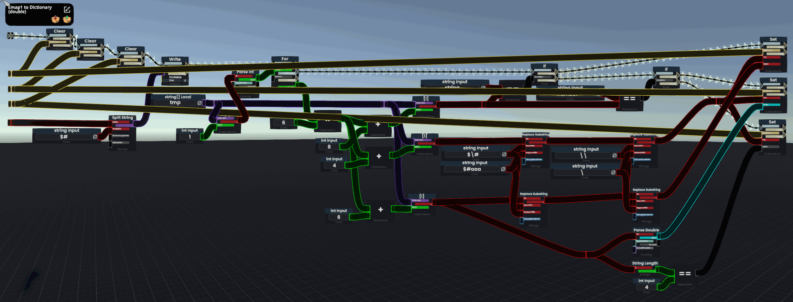
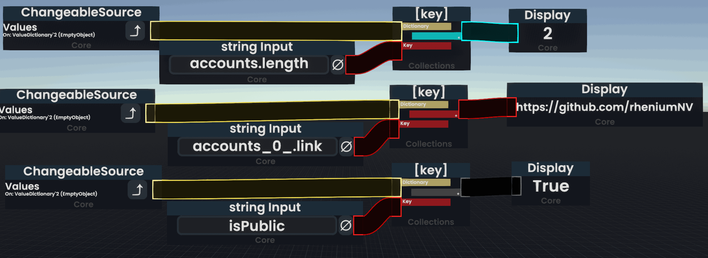
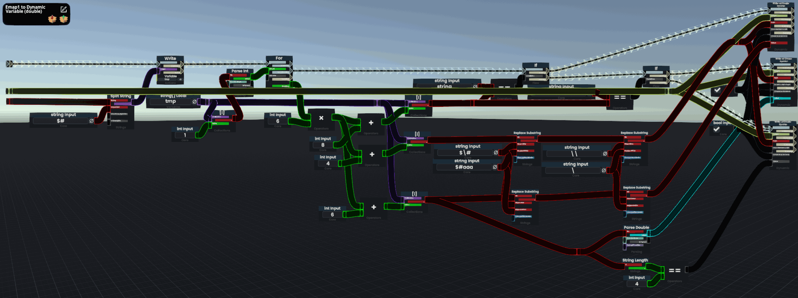
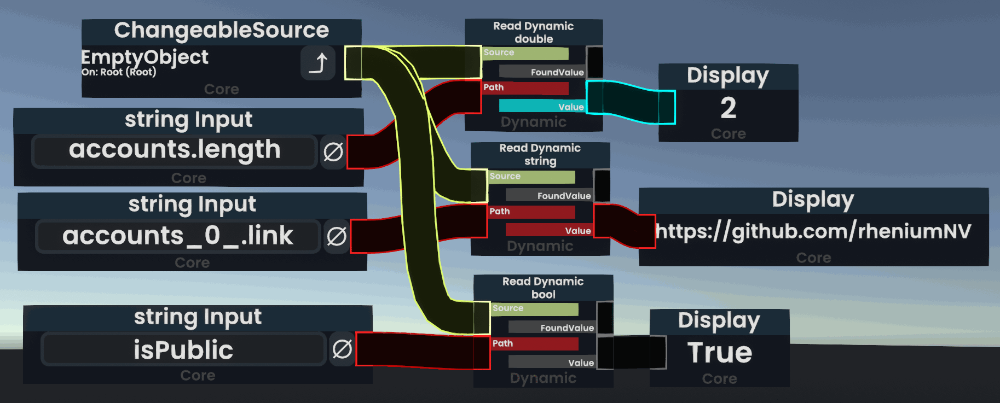
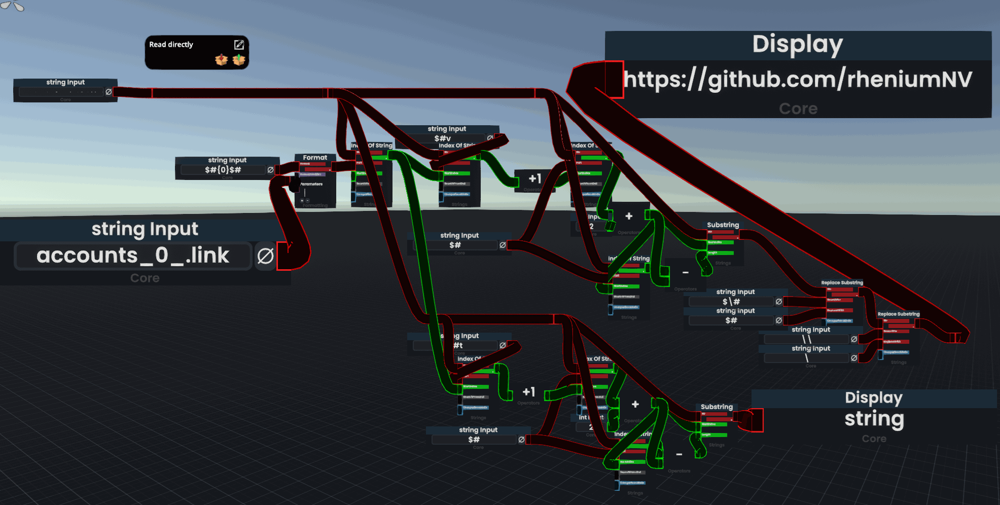

[English](README.md) | [日本語](README.ja.md)

# json2emap

Json を Emap 文字列に変換します。
Emap は [Resonite](https://resonite.com/) でパースしやすいように設計した独自のデータ形式です。

## 使い方

```sh
npm install json2emap
```

サンプル

```js
import json2emap from "json2emap";
// 名前付きでも読み込めます: import { json2emap } from "json2emap";
// CommonJS の場合: const json2emap = require("json2emap");

console.log(json2emap([1, 2, 3]));

console.log(json2emap({ a: 123, b: "Hello", c: "World" }));

console.log(
  json2emap({
    a: ["Hello", "World"],
    b: [{ c: 1, d: 2 }],
  })
);
```

Output

```text
l$#4$#v$#k0$#length$#v0$#3$#t0$#number$#k1$#_0_$#v1$#1$#t1$#number$#k2$#_1_$#v2$#2$#t2$#number$#k3$#_2_$#v3$#3$#t3$#number$#
l$#3$#v$#k0$#a$#v0$#123$#t0$#number$#k1$#b$#v1$#Hello$#t1$#string$#k2$#c$#v2$#World$#t2$#string$#
l$#6$#v$#k0$#a.length$#v0$#2$#t0$#number$#k1$#a_0_$#v1$#Hello$#t1$#string$#k2$#a_1_$#v2$#World$#t2$#string$#k3$#b.length$#v3$#1$#t3$#number$#k4$#b_0_.c$#v4$#1$#t4$#number$#k5$#b_0_.d$#v5$#2$#t5$#number$#
```

TypeScript の型定義も同梱しています。

## オプション

### resolveTypeFunc

各値の型名（`t`）を決める関数です。
デフォルトでは数値は `number`、文字列は `string`、真偽値は `bool`、それ以外は `any` になります。
配列の `length` は常に `number` です。

```js
json2emap(
  { a: 1.5, b: [1] },
  { resolveTypeFunc: (v) => (typeof v === "number" ? "float" : "string") }
);
// l$#3$#v$#k0$#a$#v0$#1.5$#t0$#float$#k1$#b.length$#v1$#1$#t1$#number$#k2$#b_0_$#v2$#1$#t2$#float$#
```

デフォルトの判定関数は `defaultResolveType` として公開されているので、拡張して使えます。

```js
import json2emap, { defaultResolveType } from "json2emap";

json2emap(
  { createdAt: new Date() },
  {
    resolveTypeFunc: (v) =>
      v instanceof Date ? "dateTime" : defaultResolveType(v),
  }
);
```

## 注意事項

- 空のオブジェクトは何も出力しません（`{ a: {} }` → `l$#0$#v$#`）。空の配列は `length`（`0`）のみ出力します。
- キー内の `.` や `_n_` はエスケープされないため、`{ "a.b": 1 }` と `{ a: { b: 1 } }` は同じキーになります。
- JSON でない値（`Date`、`Map`、`BigInt` など）は `String()` で文字列化され、型は `any` になります。`undefined` は空文字、`null` は `"null"`（型 `any`）になります。
- ルートにプリミティブ値を渡した場合（例: `json2emap(5)`）は、キーが空文字の 1 エントリになります。

## v0.x からの移行

- 出力される Emap 文字列は 0.2.1 と同じなので、Resonite 側の変更は不要です。
- `require("json2emap")` はこれまでどおり関数を返すため、CommonJS のコードはそのまま動きます。
- ES Modules（`import json2emap from "json2emap"` / `import { json2emap } from "json2emap"`）に対応しました。
- パッケージのルート以外は読み込めなくなりました。`require("json2emap/index.js")` のようにファイルを直接指定していた場合は、`require("json2emap")` に変更してください。
- TypeScript: オプションの型名が `Options` になりました。`IOption` も引き続き使えますが、非推奨です。
- デフォルトの型判定関数を `defaultResolveType` として公開しました。

古いバージョンを含む変更の一覧は [CHANGELOG.md](CHANGELOG.md) を参照してください。

## Resonite での Emap の使い方

Emap 文字列の Resonite 内での利用方法は主に 3 種類あります。
基本的には Dictionary を利用する方法が効率的で機械的に処理できるためおすすめです。
参照したい値がごく一部でキーが分かっている場合は文字列から直接抽出する方法もあります。

- 全てを Dictionary に書きこんでから利用する
- 【非推奨】全てを DynamicVariable に書きこんでから利用する
- 文字列から特定のキーの内容を直接取り出す

パブリックフォルダにサンプルが置いてあります。
（以下のリンクを Resonite 内でペーストするとパブリックフォルダとして出てきます。）

> resrec:///G-Shared-Project-rheni/R-166bcbdf-331a-4abc-9f27-8604bbf0de47

※ 0.2.0 未満のバージョンで生成した Emap 文字列は Key と Value の順番が異なるため、最新のパーサーでは読み込めません。
その場合は DynamicVariable を利用する方法のみ使えます。旧バージョン用のパーサーはパブリックフォルダ内の `/Legacy` に入っています。
可能であれば json2emap を最新バージョンに更新することをおすすめします。

### Dictionary を利用する

Dictionary への書き込み



Dictionary からの読み込み



### 【非推奨】DynamicVariable を利用する

Dictionary に比べてパフォーマンスが劣るため、現在は非推奨です。
Resonite に Dictionary が実装されるまでは主流のやり方でした。

DynamicVariable への書き込み



DynamicVariable からの読み込み



### 文字列から直接取り出す

キーを元に特定の値とその型を取得できます。



## Json から Emap に変換される手順

以下の JSON を変換してみます。

```
{
  "id": 123,
  "name": "rhenium",
  "isPublic": true,
  "accounts": [
    {
      "type": "github",
      "link": "https://github.com/rheniumNV"
    },
    {
      "type": "twitter",
      "link": "https://twitter.com/rhenium_nv"
    }
  ]
}
```

全てのパスを列挙します。
リストには length を追加し、それぞれのパスは hoge[0] ではなく hoge_0\_ と表現します。
（Resonite の DynamicVariable のキーには[]が使えないためです。）

```
[
  "id": 123,
  "name": "rhenium",
  "isPublic": true,
  "accounts.length": 2,
  "accounts_0_.type": "github",
  "accounts_0_.link": "https://github.com/rheniumNV"
  "accounts_1_.type", "twitter",
  "accounts_1_.link", "https://twitter.com/rhenium_nv",
]
```

それぞれのパスに対応する値とその型を追加します。

```
[
  {
    "key": "id",
    "value": 123,
    "type": "number"
  },
  {
    "key": "name"
    "value": "rhenium",
    "type": "string"
  },
  {
    "key": "isPublic",
    "value": true,
    "type": "bool"
  },
  {
    "key": "accounts.length",
    "value": 2,
    "type": "number"
  },
  {
    "key": "accounts_0_.type",
    "value": "github",
    "type": "string"
  },
  {
    "key": "accounts_0_.link",
    "value": "https://github.com/rheniumNV",
    "type": "string"
  },
  {
    "key": "accounts_1_.type",
    "value": "twitter",
    "type": "string"
  },
  {
    "key": "accounts_1_.link",
    "value": "https://twitter.com/rhenium_nv",
    "type": "string"
]
```

フラットにします。
各キーは 1 文字に省略しインデックスを追加します。
また、全体の長さを l に入れます。

```
key->k
value=->v
type->t
```

```
{
  "l": 8,

  "k0": "id",
  "v0": "123",
  "t0": "number",

  "k1": "name",
  "v1": "rhenium",
  "t1": "string",

  "k2": "isPublic",
  "v2": "true",
  "t2": "bool",

  "k3": "accounts.length",
  "v3": "2",
  "t3": "number",

  "k4": "accounts_0_.type",
  "v4": "github",
  "t4": "string",

  "k5": "accounts_0_.link",
  "v5": "https://github.com/rheniumNV",
  "t5": "string",

  "k6": "accounts_1_.type",
  "v6": "twitter",
  "t6": "string",

  "k7": "accounts_1_.link",
  "v7": "https://twitter.com/rhenium_nv",
  "t7": "string",
}
```

文字列にします。

"と{}は取り除きます。
:と,は$#に置換します。

l とそれ以降の文字の間に v$#を入れます。
（これは古いバージョンの Emap を処理するロジックとの互換性を保つためのものです）

この際に\\\\や$#が key か value に出てきた場合は以下のように置換します。

```
\ -> \\
$# -> $\#
```

```
l $# 8 $#

v$#

k0 $# id $#
v0 $# 123 $#
t0 $# number $#

k1 $# name $#
v1 $# rhenium $#
t1 $# string $#

k2 $# isPublic $#
v2 $# true $#
t2 $# bool $#

k3 $# accounts.length $#
v3 $# 2 $#
t3 $# number $#

k4 $# accounts_0_.type $#
v4 $# github $#
t4 $# string $#

k5 $# accounts_0_.link $#
v5 $# https://github.com/rheniumNV $#
t5 $# string $#

k6 $# accounts_1_.type $#
v6 $# twitter $#
t6 $# string $#

k7 $# accounts_1_.link $#
v7 $# https://twitter.com/rhenium_nv $#
t7 $# string $#
```

実際は空白や改行はないので以下のようになります。

```
l$#8$#v$#k0$#id$#v0$#123$#t0$#number$#k1$#name$#v1$#rhenium$#t1$#string$#k2$#isPublic$#v2$#true$#t2$#bool$#k3$#accounts.length$#v3$#2$#t3$#number$#k4$#accounts_0_.type$#v4$#github$#t4$#string$#k5$#accounts_0_.link$#v5$#https://github.com/rheniumNV$#t5$#string$#k6$#accounts_1_.type$#v6$#twitter$#t6$#string$#k7$#accounts_1_.link$#v7$#https://twitter.com/rhenium_nv$#t7$#string$#
```

これで完成です。

### エスケープの例

```
{
  "k0": "\test",
  "v0": "$#value"
}
-> k0$#\\test$#v0$#$\#value$#
```

## 生成 AI の利用について

このプロジェクトのコードやドキュメントの一部は、生成 AI ツールの支援を受けて作成しています。
すべての変更はメンテナーがレビュー・テストしたうえでリリースしています。
